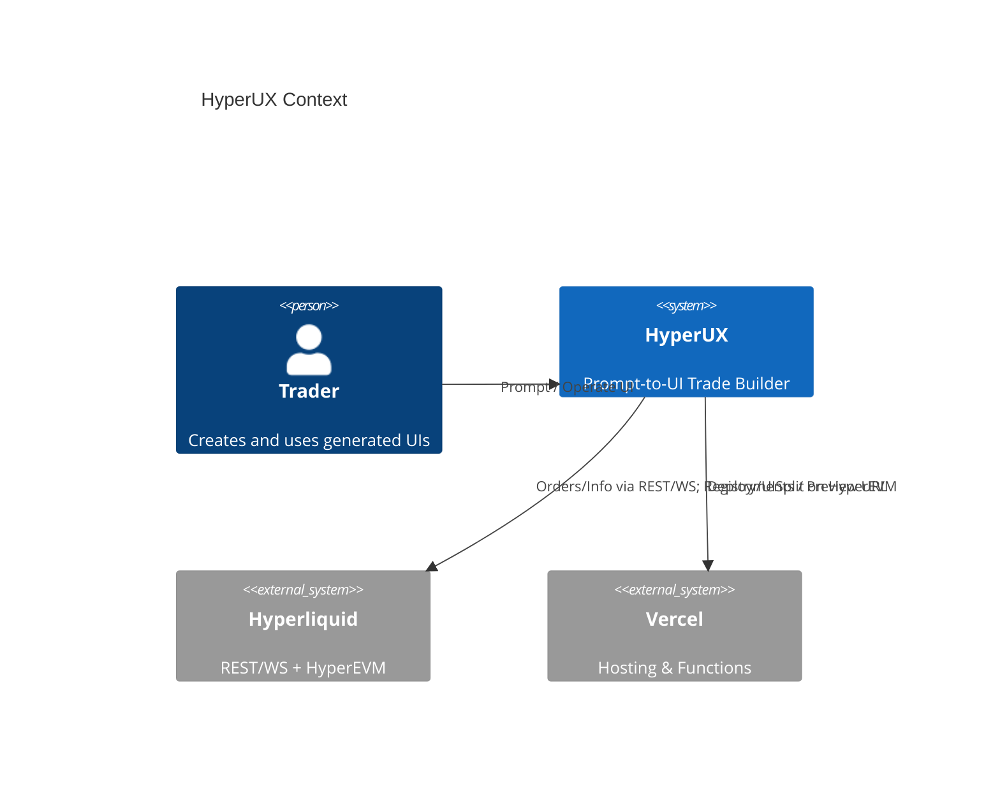
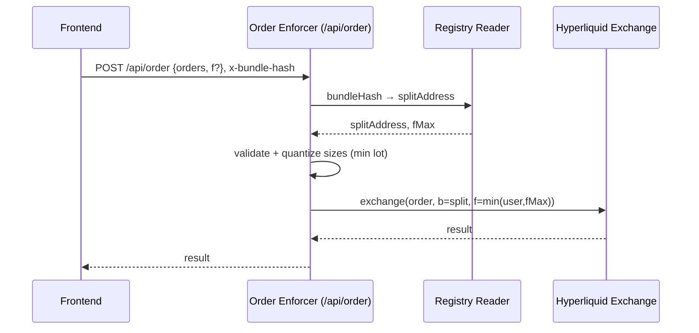

## System Context


## Container View
```mermaid
flowchart TB
  subgraph FE[Frontend: Next.js App Router]
    Chat[Chat / Prompt]
    Validator[Zod: UI DSL Validation]
    TradeUI[Generated Trade UI]
    Wallet[Reown AppKit]
  end

  subgraph BE[Vercel Functions (Node runtime)]
    APIOrder[/api/order\nBuilder Code Enforcer/]
    APIRegistry[/api/registry/*/]
    APIDeploy[/api/deploy/]
  end

  subgraph HL[Hyperliquid]
    HLAPI[(REST / WS)]
    HLEVM[(HyperEVM: Registry / UISplit)]
  end

  Chat --> Validator --> TradeUI
  Wallet -. Auth/Sign .- TradeUI
  TradeUI -->|Orders| APIOrder --> HLAPI
  APIRegistry <--> HLEVM
  APIDeploy --> HLEVM
```

## Component View（/api/order）


## Deployment View（Preview-based）
```mermaid
flowchart LR
  Dev[Dev / CI] --> Vercel[Vercel Deploy]
  Vercel --> Preview[Preview URL (immutable)]
  Preview --> Users[Users]
```

