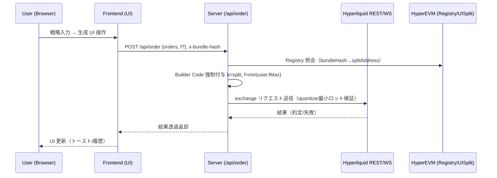

# HyperUX — ハッカソン提出資料

## 概要
- プロダクト名: HyperUX
- 一言: プロンプトから Hyperliquid に最適化されたトレード UI を自動生成し、BundleHash × EIP-712 で著作者証明、Builder Code Split で収益分配まで一気通貫。
- 技術: Next.js App Router (TypeScript) + Reown AppKit + @nktkas/hyperliquid SDK + Vercel Functions（Node runtime）
- 特徴: 生成 UI のハッシュ（BundleHash）とデプロイメントの突合、サーバ側で Builder Code を強制付与し、分配コントラクト（UISplit）へ自動送達。安全ガード・レート制限・WS 再接続など運用要件も実装済み。

## 解決する課題 / インサイト
- 既存トレード UI は汎用的で、戦略や熟練度に対して UI が過剰/不足になりやすい。
- 非エンジニアにとって「自分専用の最適 UI」を用意するコストが極めて高い。
- フロントの作者が正当に収益を得る仕組みが弱く、コピーが横行しやすい。

HyperUX は、自然言語の戦略から最小構成の UI を生成し、著作者証明と収益分配をプロトコルレベル（Builder Code × Split, Registry, EIP-712）で強制。ユーザは UI とフローに集中でき、作者は継続的に評価・収益化される。

## コア機能
- Prompt → UI DSL 生成 → ライブプレビュー → デプロイ/共有
- 個別トレード画面（板・FR・建玉・PnL 可視化、事故防止ガード、WS フォールバック）
- マーケットプレイス（作品一覧/詳細、作者/BundleHash/分配比率の透明性）
- 発注中継 API（/api/order）で Builder Code の `b=UISplit` と `f` 最大値をサーバ強制
- BundleHash 算出 → Registry 登録（EIP-712 署名）
- Reown AppKit によるウォレット接続と Arbitrum USDC → Hyperliquid への入金導線（5 USDC 未満ガード）

## アーキテクチャ（ハイレベル）
```mermaid
flowchart LR
  subgraph Client[Next.js Frontend]
    P[Prompt/Chat]
    DSL[UI DSL Validator (Zod)]
    UI[Generated Trade UI]
    WC[Reown AppKit Wallet]
  end

  subgraph Server[Vercel Functions (Node runtime)]
    OR[/api/order\nBuilder Code Enforcer/]
    RG[/api/registry/*/]
    DP[/api/deploy/]
  end

  subgraph Hyperliquid
    HLAPI[(REST / WS)]
    HLEVM[(HyperEVM\nRegistry/UISplit)]
  end

  P --> DSL --> UI
  WC -. Sign / Auth .- UI
  UI -- place order --> OR
  OR -- enforce b,f --> HLAPI
  DP --> HLEVM
  RG <--> HLEVM
```

## データフロー（注文）


## セキュリティと運用
- 秘密鍵はサーバに置かず、署名は SDK または監査済みスニペットで実施
- Builder Code/ Fee Override は常にサーバで強制。クライアント値は信頼しない
- Idempotency-Key による重複発注防止、レート制限/指数バックオフ
- WebSocket 切断時は UI を不可視化/無効化（グレーアウト）し事故を防止
- PII はログに含めず、必要ならハッシュ化

## 環境変数（主要）
- `NEXT_PUBLIC_PROJECT_ID`: Reown AppKit の Project ID
- `HYPERLIQUID_API_URL`, `HYPERLIQUID_WS_URL`: Hyperliquid REST/WS
- `HYPEREVM_RPC_URL`: Registry/UISplit 読み書き
- `REGISTRY_ADDRESS`, `UISPLIT_ADDRESS`: 収益分配のルーティング先

## 技術選定理由
- Next.js App Router: サーバとクライアントの責務分離、Vercel Functions 連携
- Reown AppKit: マルチチェーン/アダプタ/SSR に適した Wallet 接続
- @nktkas/hyperliquid: REST/WS/署名の型安全な統合

## デモ手順（想定）
1) `bun install && bun run dev` で起動し、トップ（/）でプロンプト入力
2) プレビュー UI を調整して「保存/デプロイ」→ Preview URL 発行（不変）
3) `/t/[bundleHash]` に遷移して、Reown でウォレット接続 → 入金導線（5 USDC 未満ガード）
4) 注文を送信（確認ダイアログ）→ 約定/エラーを UI で確認
5) マーケットプレイス（/market）で他作品を閲覧・利用、作者への分配が自動で反映

## 成長戦略 / ロードマップ
- v1: Prompt→UI→注文、BundleHash/Registry/UISplit、マーケットプレイス
- v1.1: UI 差分パッチ/再生成、DSL コンポーネント拡充
- v1.2: 類似プロンプトのキャッシュ/ランキング、作者向けアナリティクス
- v2: 外部データソースの拡張、オンチェーン自動化、他チェーン展開

## KPI
- TTV（入力→有効発注まで秒）、クリック数、エラー率、WS 再接続回数
- 作品利用数、分配総額、作者継続率

## チーム / 役割
- 生成 UX / フロント / API / テスト / ドキュメント運用を小さく素早く回す構成（詳細割愛）

## 参考
- Hyperliquid Docs（API/WS/Builder Codes/Bridge）
- Reown AppKit Docs
- @nktkas/hyperliquid SDK

以上、HyperUX は「誰もが数秒で自分に最適なトレード UI を得られる」体験を、著作者証明・収益分配・安全運用まで含めて提供します。

